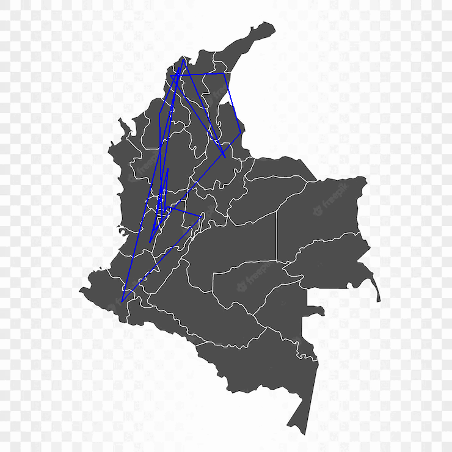
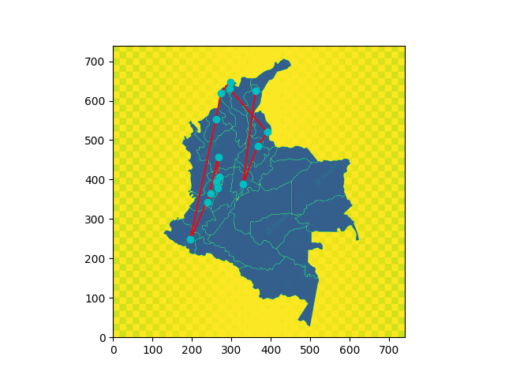

# Trabajo 1 de Redes Neuronales Artificiales y Algoritmos Bio-Inspirados de la UNAL-med
# Optimización Eurística

## A cargo de:

- Esteban García Carmona
- Emilio Porras Mejía
- Felipe Miranda Arboleda

## 1. Introducción
En el mundo de las redes neuronales y los algoritmos bioinspirados existen, al igual que en la naturaleza, muchos medios de alcanzar un objetivo (en este caso, minimizar una función; en la naturaleza: comer, reproducirse, adaptarse, sobrevivir). Por lo mismo, se trabajará utilizando diferentes tipos de optimizaciones para analizar qué ventajas y diferencias tienen entre ellas. Las que se utilizarán son: Método de descenso por gradiente con condición inicial aleatoria, algoritmos evolutivos, optimización de partículas y evolución diferencial. Además, se desea observar qué diferencias resultan de usar métodos de uso de lógica matemática, como descenso por gradiente a diferencia de los que puedan obtenerse de los bioinspirados. 

Para el análisis de las optimizaciones, se usarán dos funciones: La función de la Griewank [1] y la función Rosenbrock [2].

### Griewank:
Es una función de d variables $f(x_1,x_2,...,x_d) = y$. 

$(f(x) = 1 + \sum(x_i/4000) - \prod(\cos(x_i)/\sqrt(i))$ para $i \in 1,2,...,d$

Por lo general se evalua en $x_i \in [-600,600],\ i = 1,2,...,d$

Puede ser engañoso dado que tiene múltiples mínimos locales. Su mínimo global es $(x_1, x_2,...,x_d) = (0, 0,...,0) $

#### FOTO

### Rosenbrock:
Es una función para n variables en $f(x_1,x_2,...,x_n) = y $

$f(x) = \sum([100*(x_{i+1}-x_i^2)^2 + (x_i-1)^2])$

La función se evalúa en el dominio del hipercubo $x_i \in [-5,10]$ para todo $i = 1,2,...,n$. Su mínimo global está en $x^* = (1,1,...1)$ siendo $f(x^*) = 0$

### Algoritmos

#### Algoritmo Génetico (GA)

Para generar los algoritmos genéticos, se utilizó la librería [PyGAD](https://pygad.readthedocs.io/en/latest/) de Python. En estos algoritmos, tenemos una serie de individuos con alguna cualidad que varía (es decir, muta). De manera paralela a la naturaleza, los que mejor se adaptan son los que sobreviven. Así, se empiezan a simular múltiples generaciones y quedan los mejores individuos (gracias al elitismo, que permite la sucesión de un individuo de una generación a otra sin alteraciones), generando generaciones con características variadas (por ejemplo, con el uso del crossover que es la combinación de padres para engendrar un nuevo individuo) y demás.

#### Optimización de partículas (PSO)

Para generar los algoritmos por optimización de partículas, se usó la librería [PySwarms](https://pyswarms.readthedocs.io/en/latest/) de Python. En este algoritmo se trabaja cobre un espacio de búsqueda utilizando una cantidad alta de partículas y se les altera su posición y velocidad dependiendo del análisis de la optimización de cada punto en que se hallen. 

#### Evolución diferencial (DE)

Para generar el método de la evolución diferencial, se usó el código de 兔子爱读书, usuario del foro de programación japonés [csdn.ne](https://blog.csdn.net/ztf312/article/details/78432711). Este genera una mejora en la posición teniendo múltiples soluciones candidatas y creando nuevas con base en estas. En caso de que una mejor solución se genere, se guarda. En caso contrario, se descarta.

#### Descenso por gradiente

Es un algoritmo iterativo que toma pasos opuestos de la dirección del gradiente. Así, se logra tomar la vía del descenso más agudo, lo que puede llevar a alcanzar un mínimo, es decir, un punto en donde, sin importar dónde nos movamos, será el menor de los valores. Es de tener en cuenta que no necesariamente lleva al mínimo global (es decir, de todo el dominio), sino, posiblemente, a un mínimo global (un sector perteneciente al dominio). 

## 1. Optimización Numérica

## 1.1 Griewank

### Descenso por gradiente
Inicialmente se trabajó utilizando el método del descenso por gradiente. Como se puede observar, este sufre un problema: como lo que hace es bajar según lo que le diga la gradiente de la función, termina decantándose en el primer mínimo local que halle. En este caso, se ubicó en punto inicial cercano al mínimo global. Sin embargo, como se puede observar a continuación en la figura 1, el algoritmo se acomoda al mínimo global más cercano. Esto quiere decir que funcionaría mejor con funciones de talante no decreciente o no creciente (es decir, funciones monótonas), porque de esta manera podría navegar con mayor facilidad a través de la función hasta llegar a un mínimo. 

_figura 1: Griewank Descenso por gradiente_
   

### Algoritmos genéticos
Los algoritmos genéticos tuvieron un desempeño variado. 
El algoritmo evolutivo usado fue el de PyGAD. En este, a pesar de que se trabajó usando 200 generaciones, llegó en uno de los primeros a lo que consideró el mínimo en $(6.28, -26.63)$ con un valor de 0,187. Sin embargo, como se mostró en la introducción, este es tan sólo un mínimo local. Se puede observar esto en la figura 2.

_figura 2: gen vs fit en PyGAD_
   

En la figura 3 podemos observar lo que sucede con la función, que se acomoda en un mínimo local en vez de continuar buscando otras opciones.

_figura 3: Descenso 2D pyGAD griewank_
  
    
 En cuanto a la optimización de partículas, se observó (figura 4) que de manera similar encontró rápidamente un mínimo local en $(2.22115519, 65.33808975)$ y se quedó ahí, mejorando su posición localmente.
 
 
  

_figura 4: gen vs fit en PySwarms 2D griewank_
  

Se puede observar en la figura 5 a continuación cómo funcionó esto. Varias partículas permanecieron en el punto y las que rondaban su zona, no se continuaron desplazando. Se debería intentar utilizar más partículas pero esto llevaría a un gasto más alto de recuersos. 

 

_figura 5: Descenso 2D Swarms griewank_
  

En la evolución diferencial se obtuvo los mejores resultados. Se puede observar en la figura 6 su fitness. En este se logró hallar un valor cercanísimo al mínimo global en 2D con $(-4.634681142547457e-06, 2.4048929681146607e-06)$ lo que hace que la función alcance un valor de $8.477663016037695e-11$. 

_figura 6: gen vs fit 2d ED griewank_
  
    
En la figura 7 se puede observar que este método recorre mucho terreno y no se queda tan solo con el primer o segundo mínimo local que halla. Recorre gran parte de la gráfica entre $(-100,100)$.

_figura 7: gen vs fit 2d ED griewank_
  

Realizamos un ejemplo de Griewank por descenso por gradiente 3D y uno de evolución diferencial, dado que fue el que mejor funcionó. 

Se puede observar a continuación en la figura 8 cómo luce Griewank en un mapa de calor. Para interpretarla, se debe observar que los valores $X,Y,Z$ son las entradas que recibirá en $R^3$ la función y los colores de los puntos representan el peso o la magnitud resultante de la función. 

_figura 8: 4D griewank_

Usando Evolución diferencial, con 200 iteraciones se llegó a lo siguiente:
punto mínimo:
$(3.210418136984703, 13.135882142777437, 0.36680785800953314)$ con
$y = 0.07945049336684318$. Se puede observar que, a diferencia del 2D, no fue capaz de llegar en 200 iteraciones al mínimo global. Sin embargo, se puede observar en la figura 9 que las iteraciones fueron suficientes. Se tendría que jugar entonces con los coeficientes para lograr que, según el caso, mejore el resultado. 

_figura 9: gen vs fit ed 3D_

Y en la figura 10 se puede observar los puntos que toma y cómo va variando su valor:

_figura 10: ED 3D Griewank_

En descenso por gradiente, utilizando 300 epochs se llegó al resultado: El punto mínimo es $(-3.09437204  4.12248276  0.59673636)$ con $ y = 0.09057099912310762$. Este resultado es mayor que el de ED en 3D a pesar de haberse usado mayor número de epochs. 

Podemos ver en la figura 11 que su comportamiento es mucho menos errático que el de los algoritmos heurísticos. En este se sigue una línea concreta de valores según el contraflujo de su gradiente. 

_figura 11: Gradiente 3D_

## 1.2 Rosenbrock

### Descenso Por Gradiente
 

Se evidenció mucha dependencia para del punto inicial y el Learning Rate para encontrar el mínimo. la figura a continuación contempla 5 partículas, cada una simbolizando una aplicación de descenso por gradiente con un punto inicial randomizado diferente y siendo la mejor aproximación al mínimo $(1.08208908, 1.17122943)$

Para este método, como se aprecia en la figura 12, se utilizaron 250 iteraciones, mostrando que necesita de muchas más iteraciones para ser eficiente.

_figura 9: Imagen animada Descenso Por Gradiente de función de Rosenbrock_
  

El la figura 10 a continuación se puede apreciar una aproximación mucho mejor al mínimo con 3 variables, y 10000 iteraciones.

_figura 10: Codigo Descenso Por Gradiente de función de Rosenbrock de 3 variables_
  

### Algoritmos genéticos

### Optimización de partículas
 

En la implementación de la optimización de partículas para la función de Rosenbrock, se utilizaton 10 partículas para encontrar el mínimo global. Con unas 100 iteraciones, las partículas se acercaron considerblemente al mínimo de $(1,1)$, siendo el aproximado encontrado $(1.00457554, 1.01009669)$.
con los valores de $C1:$ 0.3, $C2:$ 0.5 y $W:$ 0.9

_figura 11: Imagen animada optimización de partículas de función de Rosenbrock_
  

En la figura 12 a continuación se evidencia que el costo del movimiento de las partículas se acentó antes de llegar a la iteración 100, alrededor de la iteración 82, incluso acentandose mucho antes y sin variar por la mayoría de las iteraciones.

Lo cuál indica que dadas más iteraciones, aunque el costo se haya acenturado, las partículas podrían encontrar de manera mucho más precisa el mínimo global de la función.

_figura 12: Imagen del costo optimización de partículas de función de Rosenbrock_
  

A continuación se muestran las imágenes animadas de $xz$ (figura 13) y $yz$ (figura 14) de la optimización de partículas para Rosenbrock de 3 variables de entrada. Siendo el vector de variables de entrada $v = (x,y,z)$

Incluso con 150 iteraciones, las partículas no tuvieron un buen acercamiento al mínimo global, siendo los puntos encontrados en $xz$ $(0.94404085, 0.7939841) $ y $yz$ $(0.89120598, 0.7939841)$ 

_figura 13: Imagen animada optimización de partículas de función de Rosenbrock en XZ_
  

_figura 14: Imagen animada optimización de partículas de función de Rosenbrock en YZ_
  

### Algoritmo Evolutivo
 

El algoritmo evolutivo utilizado para evaluar Rosenbrock fue el implementado en PyGad. Este fue implementado con 200 iteraciones, pero como se puede apreciar en la figura 15 a continuación, encontró una aproximación considerable del mínimo desde muy temprano.

_figura 15: Imagen animada Algoritmo Evolutivo de función de Rosenbrock_
  

La aproximación encontrada por el algoritmo implementado en PyGAD fue $(1.03489707, 1.07821128)$.

_figura 16: Imagen animada Algoritmo Evolutivo de función de Rosenbrock_
  

### Evolución diferencial
 

Utilizando el algoritmo descrito en la introducción, se puede evidenciar que, aunque no es el más rápido en encontrar un mínimo, es el más preciso para encontrarlo con una precisión de $1e^{-3}$. El mínimo encontrado fue $(1.000046850087367, 1.000105464503063)$

_figura 17: Imagen animada Evolución diferencial de función de Rosenbrock_
  

## Conclusiones
* Es de notarse que la velocidad en la que los algoritmos heurísticos se desplazan es muy alta. Logran visitar muchos puntos en esta clase de funciones que tienen cientos o miles de mínimos.
* El descenso por gradiente debe ser modificado para evitar que caiga en mínimos locales. Es un método muy interesante y útil, con unas bases matemáticas limpias. Sin embargo, se tendría que ejecutar cientas de veces desde muchos puntos iniciales para poder vencer funciones con muchos mínimos locales, tales como Griewank.
* En esta ocasión, para la función de Griewank, el método que mejor se comportó fue el de evolución diferencial, que fue capaz de recorrer rápidamente muchos mínimos locales hasta hallar el mínimo global en $(0,0)$.
* El en caso de Rosenbrock, se puede notar que el desempeño de descenso por gradiente es muy afectado por el punto inicial, el learning rate y la cantidad de iteraciones que se le definan, incluso sin tener muchos mínimos locales en los que pueda caer. Con ciertos puntos iniciales encuentra en muy pocas iteraciones el punto mínimo sin ningún problema, o dependiendo del learning rate, puede o encontrarlo o no encontrarlo nunca.
* En el caso de rosenbrock, por no tener muchos mínimos locales, como Griewank, es mucho más útil y confiable, aunque no sea ni el más rápido ni el más preciso en encontrar el mínimo.
* Al experimentar con tantos métodos de optimización, se evidencia que todos son útiles y no necesariamente uno siempre es mejor que otro, pero sí se debe tener en cuenta qué tipo de función se quiere analizar con ellos para saber cuál es el mejor a implementar en futuros proyectos.
  

## 2. Optimización Combinatoria

## Problemática

Se debe resolver el problema del vendedor viajero para varias ciudades principales de Colombia. El objetivo es hallar un camino que, pasando por cada ciudad por lo menos una vez, minimice el costo definido por la suma del valor de la hora del vendedor, el costo de los peajes y el costo del combustible.

## Procedimiento

Se solucionó el problema por dos vías diferentes: Algoritmos genéticos (GA) y Colonia de hormigas (AC).

1. Creamos la base de datos de las ciudades a visitar con sus respectivas coordenadas [1].

| Cod Mun | Municipio    | Cod Dep | Departamento       | Latitud     | Longitud     |
|---------|--------------|---------|--------------------|-------------|--------------|
| 63001   | Armenia      | 63      | Quindio            | 4,5338889   | -75,6811111  |
| 8001    | Barranquilla | 8       | Atlantico          | 10,9638889  | -74,7963889  |
| 11001   | Bogota D.C.  | 25      | Cundinamarca       | 4,6         | -74,0833333  |
| 68001   | Bucaramanga  | 68      | Santander          | 7,1297222   | -73,1258333  |
| 13001   | Cartagena    | 13      | Bolivar            | 10,3997222  | -75,5144444  |
| 54001   | Cucuta       | 54      | Norte de Santander | 7,8833333   | -72,5052778  |
| 17001   | Manizales    | 17      | Caldas             | 5,07        | -75,5205556  |
| 5001    | Medellin     | 5       | Antioquia          | 6,2913889   | -75,5361111  |
| 23001   | Monteria     | 23      | Cordoba            | 8,7575      | -75,89       |
| 76520   | Palmira      | 76      | Valle del Cauca    | 3,5394444   | -76,3036111  |
| 66001   | Pereira      | 66      | Risaralda          | 4,8133333   | -75,6961111  |
| 52001   | Pasto        | 52      | Narino             | 1,214670737 | -77,27864742 |
| 8758    | Soledad      | 8       | Atlantico          | 10,9172222  | -74,7666667  |
| 76834   | Tulua        | 76      | Valle del Cauca    | 4,0866667   | -76,2        |
| 20001   | Valledupar   | 20      | Cesar              | 10,4769444  | -73,2505556  |

2. Procedemos a construír la matriz de costos. La entrada i,j de esta matriz contendrá el costo en pesos de ir de la ciudad i a la ciudad j. Éste, a su vez es la suma del salario por horas del vendedor, costo de los peajes y el costo del combustible en valores del 2023.

    Costo hora del vendedor: El salario promedio de un conductor en colombia es de $6.827/hora [2].

    Costo de los peajes: Se estableció el costo de los peajes, el tiempo estimado de viaje y la distancia para cada par de ciudades [3].

    Costo del combustible: El recorrido se hará en un Mini Cooper 1.6, cuyo rendimiento es de 8,35 litros / 100 km [4]. Además, el costo promedio de un litro de gasolina corriente en Colombia es de $2.747,31/litro [5]. 

    Importamos las tablas de tiempo de viaje, costo de los peajes y distancia entre ciudades. Para así calcular la siguiente matriz de costos totales en pesos:

| Armenia | Barranquilla | Bogota D.C. | Bucaramanga | Cartagena | Cucuta | Manizales | Medellin | Monteria | Palmira | Pereira | Pasto | Soledad | Tulua | Valledupar |
|---|---|---|---|---|---|---|---|---|---|---|---|---|---|---|
| 0.0 | 484086.92267999996 | 158390.37857 | 276519.39869 | 488048.897655 | 373928.47954 | 75171.62696 | 154821.05318 | 386649.35525499994 | 109939.39929999999 | 33138.218479999996 | 272342.285215 | 484086.92267999996 | 109939.39929999999 | 418535.755365 |
| 484086.92267999996 | 0.0 | 489627.626915 | 284902.81522499997 | 74886.8562 | 302841.99294499995 | 436731.38418999995 | 355567.88026999997 | 163759.57590499998 | 610085.74202 | 493162.99425 | 773854.0279349999 | 0.0 | 610085.74202 | 155067.773575 |
| 158390.37857 | 489627.626915 | 0.0 | 200351.15669499998 | 502543.99425 | 248886.51444499998 | 154480.32627 | 232200.960555 | 434579.62032 | 270600.13864 | 185157.48242999997 | 431240.645325 | 489627.626915 | 270600.13864 | 390112.273795 |
| 276519.39869 | 284902.81522499997 | 200351.15669499998 | 0.0 | 306205.39025 | 94314.92623 | 227708.18558 | 218759.15553999998 | 331638.676045 | 399633.056065 | 271317.30521499994 | 551325.6389 | 284902.81522499997 | 399633.056065 | 201113.822865 |
| 488048.897655 | 74886.8562 | 502543.99425 | 306205.39025 | 0.0 | 315763.86143499997 | 431280.009935 | 334374.8464 | 152632.20626 | 577374.299255 | 452510.226865 | 735962.15209 | 74886.8562 | 577374.299255 | 168573.980525 |
| 373928.47954 | 302841.99294499995 | 248886.51444499998 | 94314.92623 | 315763.86143499997 | 0.0 | 317427.01719 | 300072.69022999995 | 348359.996075 | 478131.01729 | 361290.12759499997 | 639821.111665 | 302841.99294499995 | 478131.01729 | 215874.40212499996 |
| 75171.62696 | 436731.38418999995 | 154480.32627 | 227708.18558 | 431280.009935 | 317427.01719 | 0.0 | 99300.11468999999 | 322660.35099999997 | 161951.94933 | 44775.21079 | 252075.94324 | 436731.38418999995 | 161951.94933 | 366919.97109999997 |
| 154821.05318 | 355567.88026999997 | 232200.960555 | 218759.15553999998 | 334374.8464 | 300072.69022999995 | 99300.11468999999 | 0.0 | 234263.495925 | 244004.413625 | 119375.24277499999 | 405334.06877 | 355567.88026999997 | 244004.413625 | 347255.136825 |
| 386649.35525499994 | 163759.57590499998 | 434579.62032 | 331638.676045 | 152632.20626 | 348359.996075 | 322660.35099999997 | 234263.495925 | 0.0 | 458683.35762499995 | 344100.87908499996 | 625157.8531549999 | 163759.57590499998 | 458683.35762499995 | 200927.126705 |
| 109939.39929999999 | 610085.74202 | 270600.13864 | 399633.056065 | 577374.299255 | 478131.01729 | 161951.94933 | 244004.413625 | 458683.35762499995 | 0.0 | 127769.59085 | 177239.63937999998 | 610085.74202 | 0.0 | 525409.23966 |
| 33138.218479999996 | 493162.99425 | 185157.48242999997 | 271317.30521499994 | 452510.226865 | 361290.12759499997 | 44775.21079 | 119375.24277499999 | 344100.87908499996 | 127769.59085 | 0.0 | 278667.52407 | 493162.99425 | 127769.59085 | 409963.84150499996 |
| 272342.285215 | 773854.0279349999 | 431240.645325 | 551325.6389 | 735962.15209 | 639821.111665 | 252075.94324 | 405334.06877 | 625157.8531549999 | 177239.63937999998 | 278667.52407 | 0.0 | 773854.0279349999 | 177239.63937999998 | 685441.7648049999 |
| 32102800.788 | 0.0 | 489627.626915 | 284902.81522499997 | 74886.8562 | 302841.99294499995 | 436731.38418999995 | 355567.88026999997 | 163759.57590499998 | 610085.74202 | 493162.99425 | 773854.0279349999 | 0.0 | 610085.74202 | 155067.773575 |
| 11446906.425999999 | 44665970.880499996 | 270600.13864 | 399633.056065 | 577374.299255 | 478131.01729 | 161951.94933 | 244004.413625 | 458683.35762499995 | 0.0 | 127769.59085 | 177239.63937999998 | 610085.74202 | 0.0 | 525409.23966 |
| 418535.755365 | 155067.773575 | 390112.273795 | 201113.822865 | 168573.980525 | 215874.40212499996 | 366919.97109999997 | 347255.136825 | 200927.126705 | 525409.23966 | 409963.84150499996 | 685441.7648049999 | 155067.773575 | 525409.23966 | 0.0 |

3. Se implementaron algoritmos genéticos por medio de python [6] y se obtuvo el siguiente gif que representa la evolución de la mejor ruta a lo largo de las generaciones:

    

    _figura x: Mapa de Colombia con recorridos_ 

    Con lo que la mejor ruta encontrada por los algoritmos genéticos fue:

    Pasto -> Palmira -> Tulua -> Armenia -> Pereira -> Medellin -> Manizales -> Bogota D.C. -> Bucaramanga -> Cucuta -> Valledupar -> Soledad -> Barranquilla -> Cartagena -> Monteria

    Con un costo de: $1.586.600 COP

4. Se implementó colonia de hormigas por medio de python [7] y se obtuvo el siguiente gif que representa la evolución de la mejor ruta que descubren 100 hormigas:

    

    _figura x: Mapa de Colombia con recorridos de hormigas_ 

    Con lo que la mejor ruta encontrada por la colonia de hormigas fue:

    Pereira -> Armenia -> Palmira -> Tulua -> Manizales -> Pasto -> Bogota D.C. -> Bucaramanga -> Cucuta -> Valledupar -> Soledad -> Barranquilla -> Cartagena -> Monteria -> Medellin

    Con un costo de: $2.013.640 COP

## Conclusiones

- Ambos algoritmos lograron solucionar el problema con resultados mucho mejores que el azar o un análisis a priori.

- Los algoritmos genéticos se desempeñaron mejor que las colonias de hormigas, pero se sospecha que se debe a la capacidad de cómputo limitada que solo permitió simular 100 hormigas.

- Recorrer todas las ciudades deseadas por poco más de un millón y medio de pesos parece muy razonable, más aún teniendo en cuenta que se escogió un vehículo que no tiene un rendimiento de combustible destacable.

## Bibliografía y referencias
[1] "Virtual Library of Simulation Experiments" (2013). Griewank Function [Online]. Available: https://www.sfu.ca/~ssurjano/griewank.html
[2] "Virtual Library of Simulation Experiments" (2013). Rosenbrock Function [Online]. Available: https://www.sfu.ca/~ssurjano/rosen.html
Optimization — Descent Algorithms
https://towardsdatascience.com/optimization-descent-algorithms-bf595f069788

- [1] “Geoportal del DANE - Codificación Divipola,” geoportal.dane.gov.co. https://geoportal.dane.gov.co/geovisores/territorio/consulta-divipola-division-politico-administrativa-de-colombia/ (accessed Mar. 10, 2023).

- [2] “Salario para Conductor en Colombia - Salario Medio,” Talent.com. https://co.talent.com/salary?job=conductor#:~:text= (accessed Mar. 10, 2023).

- [3] S. O. C. S.A.S, “Peajes en Colombia [2022],” Viaja por Colombia. https://viajaporcolombia.com/peajes/ (accessed Mar. 10, 2023).

- [4] “Consumo Gasolina: 8,35 l/100km - Mini, Mini Cooper, Mini Cooper 1.6,” www.spritmonitor.de. https://www.spritmonitor.de/es/detalle/125236.html?cdetail=1 (accessed Mar. 10, 2023).

- [5] “Colombia precios de la gasolina, 06-marzo-2023,” GlobalPetrolPrices.com. https://es.globalpetrolprices.com/Colombia/gasoline_prices/#:~:text=El%20valor%20medio%20durante%20este (accessed Mar. 10, 2023).

- [6] M. Kukreja, “Travelling-Salesman-Problem-with-Genetic-Algorithm,” GitHub, Oct. 10, 2022. https://github.com/manpreet1130/Travelling-Salesman-Problem-with-Genetic-Algorithm (accessed Mar. 10, 2023).
‌
- [7] R. Zhang, “ant-colony-tsp,” GitHub, Feb. 27, 2023. https://github.com/ppoffice/ant-colony-tsp (accessed Mar. 10, 2023).
